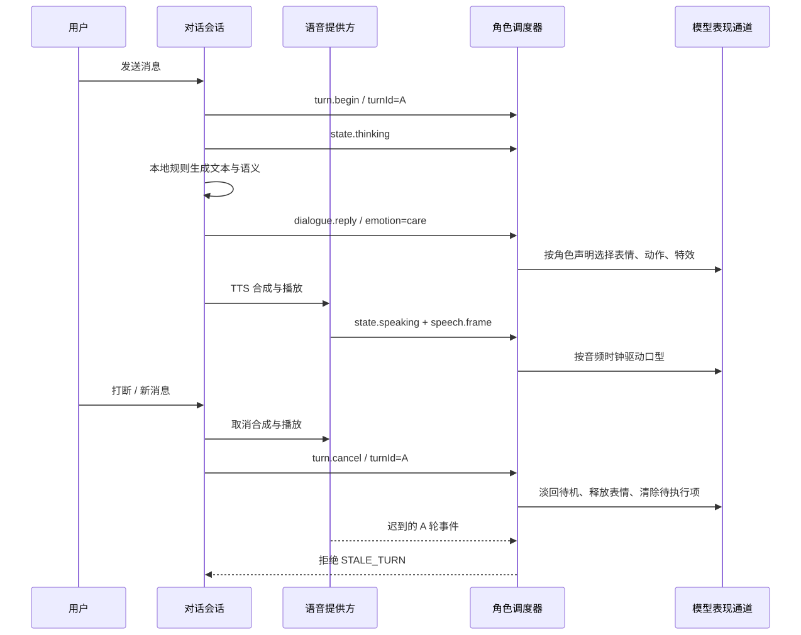

# 小伴角色平台架构 · v1.1

> 1.1 新增：持续站/坐/蹲/躺、姿势参数、专用动作和聊天配置。请同时阅读[姿势制作与接口标准](05-posture-standard.md)，它定义持久姿势和一次性动作的区别。旧包继续兼容。

2026-09-28。目标：应用、对话能力和角色制作可以由不同团队独立迭代；角色通过可验证的数据契约接入，避免一个新模型带来一组新的业务分支。

2026-09-29 宿主边界补充：公开/自建角色的固定作者定义与听众数据分离。作者定义决定人格、外观、环境及默认表现；听众保留自己的朗读静音、专属曲目/音量、私聊与记忆。当前封面按基础 runtimeID 固定关联，实例音频 ID 按 characterInstanceID 隔离；旧版列出的编辑能力不等于当前会话向订阅者开放全部编辑。具体字段、旧快照音乐迁移及现阶段封面限制见[角色集合标准](character-collections.md)。

## 1. 系统边界

| 层 | 负责 | 不负责 |
|---|---|---|
| 应用与用户数据 | 登录、聊天界面、历史、记忆、人格、外观参数、取景、声音设置 | 不引用骨骼路径、网格名称或动画资源路径 |
| 对话提供方 | 文本、语义事件、情绪、强度；未来可加入内容策略与结构化动作意图 | 不直接执行动画、不返回代码 |
| 语音提供方 | 识别文本、合成音频、播放状态、音频时间、可选 viseme 帧 | 不决定角色表情和肢体动作 |
| Character API | 标准信号、身份与轮次、版本、能力、回执 | 不绑定 SwiftUI、具体大模型或具体骨骼 |
| 角色调度器 | 事件匹配、优先级、通道调度、冷却、延迟、降级和取消 | 不解释聊天原文，不运行模型包脚本 |
| 表现通道 | 动画、表情、口型、视线、特效、外观参数和触摸区域 | 不修改聊天历史、人格和账号 |
| 角色包编译器 | 验证数据与资源、GLB 导入、显式绑定、预览图、动作取景、同源目录 | 不为每个新角色增加 Swift / C# 业务逻辑 |

已有 Luma、初音和小夏保留原美术构建器，作为 **legacy authoring adapters**。它们统一生成符合相同运行时契约的角色。小夏旧捏脸工具通过 `legacy.human-studio@1` 标识；外部包不能依赖它。现有 MakeHuman/MMD 特定骨骼修复和头发模拟仍属于对应适配器，并没有假装变成任意模型通用的物理系统。

新增的小乐直接来自独立 GLB 包，不经过上述美术构建器。动作清单、描述、缩略图、外观选项和语义规则均由 manifest 生成。

## 2. 三种身份与四种版本

- `id`：App 用户资料主键，例如 `sample-robot`。发布后稳定，换模型资源不应换 ID；不同角色不能复用。
- `packageId`：制作方的反向域名标识，例如 `org.example.characters.lan`。不能冒用内置包身份。
- `eventId` / `turnId` / `sequence`：分别表示单次事件、一次可取消的对话生成、当前展示会话的单调递增序号。
- `schemaVersion`：角色清单结构主版本，当前 1。
- `apiMajor / minApiMinor`：角色需要的表现协议。主版本不同拒绝，低于最小次版本拒绝。
- `packageVersion`：角色内容版本，SemVer；保留 ID 的修复和可选增量变化可升级。
- `capability@major`：局部能力的独立版本。不能把行为变化悄悄塞进相同能力版本。

原生目录与 Unity 导出记录相同的目录 SHA-256。构建脚本发现目录变化而 Unity 未重新导出时直接失败，避免 App 显示一个实际并未编入引擎的角色。

## 3. 对话与表现的运行链路

`DialogueProviding` 把当前情景库和未来在线/端侧模型隔开。本次实现仍为本地情景对话；没有把规则库称为大语言模型。当前语义包含 greeting、gratitude、dance、jump、普通 reply 与 joy/care/neutral 情绪。

推荐未来对话服务返回 `{text, eventName, emotion, intensity}` 或带时间的语义计划，由应用做长度、枚举、强度、用户偏好和能力过滤，再送入 Character API。模型输出只作为“意图”，不拥有文件系统、Shader、骨骼和脚本访问权。角色规则选择本模型适合的表现；例如真人没有跳跃时可用温和的致意代替，而不是播放并不存在的动画。

当前 `CharacterDirector` 对每个通道维护一个优先级租约。数值更高优先；同优先级新事件可替换旧事件。动作通道按真实 clip 时长占用，表情、视线和特效按 cue duration 占用。没有队列无限增长：最多 64 个延迟 cue，最多保存 256 个去重事件。更旧的序号仍会被拒绝，因此去重窗口外的旧消息也不能重新执行。

默认建议优先级：环境/欢迎 20，普通回复 30–40，明确对话动作 65，触碰 75，用户动作按钮 80。包规则最大 90，为未来系统中断保留空间。概率仅用于表现变体，不能控制账号、消息保存或业务结果。

当前身体通道是一个完整动作槽，使用连续动画曲线和 CrossFade；**没有实现上半身/下半身任意混合**。表情、口型、视线和效果可同时工作；导入时禁止外观、表情和口型竞争同一 morph。表情增量会平滑加入动画基线并恢复；自然视线保留头颈限幅与背向释放逻辑。

## 4. 生命周期和异常

- 新展示：选角色、绑定清单、清理旧通道、重置 sequence、发送 `session.enter`。
- 新对话：`turn.begin` 取消旧待执行项并建立新 turn；thinking → reply → speaking → idle。
- 打断：停止本机合成/播放，同时 `turn.cancel` 清理角色动作、口型和延迟特效。身体淡回当前持久姿势，表情平滑释放；瞬态粒子直接清除。
- 切换角色/关闭页面：释放旧表现状态，历史、人格和保存的外观仍按稳定角色 ID 保留。
- 迟到事件：角色不符、旧序号、已取消轮次、倒退的音频时钟分别拒绝。
- 未知可选事件/通道：忽略或返回 degraded；不会把整个角色界面关闭。未知必要能力、缺失必需资源和错误绑定在导入/构建阶段失败。
- 常规运行不把每帧骨骼信息往 Swift 发送。音频帧不回传完整角色快照，避免音频采样触发头部网格烘焙。
- 低电量、发热、后台中断仍由已有性能/语音生命周期管理负责；角色包不能强制覆盖系统策略。

回执中的 `executed` 对延迟 cue 表示已接纳排程，不是已经到屏幕上的证明；视觉完成以动作完成事件、状态采样及验收录像为准。

## 5. 场景覆盖与扩展矩阵

| 能力/场景 | 当前 v1 状态 | 后续扩展边界 |
|---|---|---|
| 文字聊天、流式显示、历史、人格和记忆 | 已有；提供方接口已隔离 | 增加在线/端侧模型提供方 |
| 聆听、思考、说话、待机 | 已接入语义状态 | 可为不同状态配置规则，不改界面 |
| 打招呼、感谢、安慰、庆祝、明确动作请求 | 已实现规则映射与回退 | 增加事件/规则即可覆盖其他情景 |
| 身体动作、动作按钮、平滑回待机 | 已实现单身体通道 | 多层混合、AvatarMask、动作图须新增能力版本 |
| 表情、持续时长、强度、平滑恢复 | 已实现命名 morph 组合 | FACS/ARKit 表情集合、情绪连续空间可增加适配器 |
| 口型 | 已实现音量驱动与 viseme 帧入口 | 当前 TTS 只输出音量，尚无真实音素预测/强制对齐 |
| 视线 | 已实现显式头颈眼映射、限幅、背向释放、动作让权 | 多目标、手持物关注、眼动微扫须新策略 |
| 触摸 | 头部精确网格命中，其他声明区域为骨骼球形热点 | 长按/抚摸/多点触摸可加事件；当前没有复杂手部触觉 |
| 小特效 | 已实现星光、爱心预设及锚点/颜色/数量 | 任意粒子图、VFX Graph、自定义 Shader 尚未开放 |
| 外观 | 已实现通用 morph、基础色、variant；旧真人工作室保留 | 跨角色衣柜、拓扑变化、毛发系统需单独资产协议 |
| 光影、背景、有限范围取景 | 继续使用已有平台公共能力 | 环境包已由独立 XEP 1.0 实现，见 ../environment-standard/README.md |
| 持久站/坐/蹲/躺与对话调整 | 已实现姿势能力、参数、专用动作和保存 | 新姿势按包扩展；地面支撑，见 05-posture-standard.md |
| 道具、坐椅、接触 IK、多人互动 | 已划分能力命名空间，未实现执行器 | 加 props/contacts/ik/actors 能力，旧包保持原行为 |
| 布料、碰撞、春骨、写实头发 | 仅已有模型适配器内的专用实现 | 通用物理配置需预算、碰撞代理与新能力；不能承诺自动无穿模 |
| VRM、Humanoid 重定向、VRMA | 对齐概念，未实现本项目导入器 | VRM/VRMA 编译适配器输出同一内部契约 |
| 手机内下载角色、热更新、商店 | 未实现；当前构建时导入 | 签名目录、校验、缓存、回滚、增量包作为分发层新增 |
| 端侧/服务端自由对话大模型 | 未实现 | 替换 DialogueProviding，不更换角色资源标准 |
| 社交、礼物、任务、关系成长 | 未实现业务机制 | 业务层产生语义事件，不直接驱动骨骼 |

## 6. 兼容演进规则

“所有未来场景都零兼容成本”无法诚实保证：物理、渲染、拓扑或执行语义变化可能要求新运行时或资产迁移。这里承诺可执行的边界：

1. **增量可选数据**：旧读者忽略未知字段；扩展放入反向域名命名的 `extensions`，不抢占 `core.*`。
2. **能力协商**：重要新能力列 required；旧运行时拒绝而非错误显示。装饰性功能列 optional，并提供基础回退。
3. **不重新解释旧字段**：单位、坐标、强度、ID 的语义不变。改变语义发布新 major，并提供显式迁移器。
4. **持久化 ID 不漂移**：删掉参数/动作、重排枚举选项、缩窄参数范围可能影响保存的资料。升级检查必须拦截；迁移需要版本、映射和回滚测试。
5. **源包长期保留**：GLB/JSON/贴图和授权为稳定源，不把 Unity AssetBundle 当永久母版。引擎版本和目标平台变化后重新编译。
6. **双读与过渡窗口**：未来 major 升级先同时读旧/新格式，写新格式，留可恢复副本。不要静默删除旧用户数据。
7. **契约样例回归**：每次升级跑旧样本、新样本、未知可选项、未知必要项、缺失资源和取消时序。SDK 版本随应用发布。

本次保留 bridge 外层 v1 和旧 `playAction`/`companionState`/`speechFrame` 兼容入口；新原生代码已经使用语义信号。旧入口仅用于过渡，新的外部制作方不得依赖它们。

## 7. 来源与选择依据

VRM 为 glTF 人形角色定义元数据、表达式和视线等语义，适合长期互通；VRM 规范也区分了动画扩展，因此“能读 GLB”不能等价于“完整支持 VRM”。本项目当前复用已安装的 glTFast 6.16.1 做 GLB 导入，先交付可以验收的通路。[VRM 1.0 规范](https://github.com/vrm-c/vrm-specification/blob/master/specification/VRMC_vrm-1.0/README.md)、[表达式](https://github.com/vrm-c/vrm-specification/blob/master/specification/VRMC_vrm-1.0/expressions.md)、[视线](https://github.com/vrm-c/vrm-specification/blob/master/specification/VRMC_vrm-1.0/lookAt.md)。

GLB 保留标准 glTF 的网格、材质、蒙皮、morph 与动画表达，JSON Schema 用于清单的可执行验证。[glTF 2.0 规范](https://github.com/KhronosGroup/glTF/blob/main/specification/2.0/Specification.adoc)、[JSON Schema 2020-12](https://json-schema.org/draft/2020-12)。

Unity 的编译资源与平台及引擎版本有关，所以我们把稳定源包和设备编译产物分开，未来更新引擎时重编译资产。[Unity AssetBundle 文档](https://docs.unity.com/en-us/engine/6000.0/manual/assets-and-media/assets-managing-runtime/assetbundles-section/asset-bundles-intro)。

### 2026-10-03 自然骨骼待机扩展

AvatarNaturalMotion 是运行时共用的限幅附加层，位于原作连续性/视线之后、情绪动作及次级物理之前。使用已审查的 Human/局部轴校准与当前作者姿态，提供肩肘手腕/手指、呼吸、骨盆重心与脚底约束；非站姿/原作动作优先且淡出，不是任意混合作者上下身动画。附加校准与状态字段可选，旧包降级派生直接腿链。详见 [实施与验证](../natural-body-and-visible-asides-2026-10-03.md)。

AvatarClothingClearance 在新增肢体动作之后、次级物理之前提供服装包络避让；胶囊来自 Human 映射与实际蒙皮厚度，一次校准，不每帧烘焙。它限制宿主动作造成的新挤压，衣物/配饰链以整段接触求解，保留原作接缝、控制权和碰撞白名单。这是可选宿主适配，不能宣称所有网格布料自碰撞或完整 PhysBone 仿真；对来源角色只增加运行时缓存，原资产不变。恢复顺序 10、执行顺序 100，字段与来源标记见上述实施文档。
