# 第一版开发方案：iPhone / iPad 本地 3D 模型查看 App

> **实施更新（2026-09-26）**：本文保留最初方案。用户随后授权完整开发、要求先在 iPhone 17 模拟器运行，并追加动作按钮与触头摇头；这些最新要求覆盖文中的“尚未实现”“不播放动作”“暂不承诺模拟器”等早期限定。当前实现与实测证据请看 [README](../../README.md)、[开发记录](../development-notes.md)和[模拟器验收](../simulator-acceptance.md)。两台真机状态仍为 NOT TESTED。

- 日期：2026-09-25；方案版本：V1.0。
- 文档状态：可执行的开发设计，功能尚未实现；不代表真机验收通过。
- 用户明确目标：一个有原生界面的 iOS App，兼容 iPhone 17 标准版与 2024 年 11 英寸 iPad Pro，可选择并打开一个初始 3D 模型。
- **用户已确认交互范围：旋转＋缩放＋复位，先做好模型查看；第一版不播放角色动作。**
- 产品工作名：模型空间；工程继续使用 CharacterHost / CharacterRuntime。显示名可调整，不影响架构。

## 1. 交付目标和方案关系

第一版的完整使用过程：打开 App → 在首页选择 RobotExpressive 模型卡片 → 查看加载反馈 → 进入真实 3D 页面 → 拖动观察、双指缩放、复位 → 返回首页 → 再次打开仍然正常。

同一个 Universal App、同一个宿主工程、一个稳定 Bundle Identifier，分别安装到两台指定设备。所有模型展示所需资源随 App 提供，开发授权就绪后可断网查看。

本方案是对[原交接技术方案 v1.1](../../ios_3d_mvp_technical_spec_v1_1.md)的实施细化。文档采用顺序为：用户最新明确要求 → 本方案中的产品与实施设计 → [实际环境记录](../environment.md)中的已验证版本 → 原交接方案中的基础技术约束。不能把旧文档中的“候选版本”覆盖已经实测通过的依赖锁。

| 与原交接方案的差异 | 本方案决定 |
|---|---|
| 只有查看按钮的技术原型首页 | 设计一个真实模型卡片、缩略图、名称、简介和打开入口 |
| 模型静态展示，只有复位 | 增加用户确认的手指旋转和双指缩放；保留复位 |
| glTFast 6.14.1 候选 | 使用已验证的 6.16.1，原因见环境记录 |
| 编辑器操作方式未细化 | Unity CLI 优先；Pipeline 作为需要实际接入验证的开发辅助包 |
| 双设备默认全屏竖屏 | iPhone 以竖屏为首版范围；iPad 增加横竖屏布局和窗口尺寸变化的验证 |
| 技术诊断常驻展示 | 用户界面显示模型和操作提示；性能信息置于开发诊断模式 |
| 阶段 A 尚未通过不能宣称后续设备通过 | 保留设备签名门槛；设备未连接时允许继续源码与本机验证，双设备状态保持 NOT TESTED |

本轮交付的是方案和任务划分，不创建正式 App 功能，也不把现有构建探针当成正式 App。

## 2. 第一版范围

### 2.1 必须交付

| ID | 功能 | 完成定义 |
|---|---|---|
| F01 | 原生模型首页 | SwiftUI 页面有完整层级、一个真实模型卡片和打开按钮；首页不启动 Unity 场景 |
| F02 | 本地模型选择 | 首版只提供 RobotExpressive，点击卡片或按钮均进入同一查看流程 |
| F03 | 加载与错误反馈 | 显示实际加载状态；重复点击不重复启动；失败后能返回，并按错误类型提供恢复方式 |
| F04 | 真正的 3D 查看 | Unity 实时渲染 RobotExpressive，模型、材质和灯光正确 |
| F05 | 手势旋转 | 单指在 3D 区域拖动可环绕观察；俯仰角有限制 |
| F06 | 双指缩放 | 双指张合改变观察距离，有近远限制，触点变化不会导致视角跳变 |
| F07 | 一键复位 | 原生按钮恢复默认角度、距离和观察中心，取消正在进行的手势状态 |
| F08 | 返回与再次打开 | 回原生首页，暂停引擎更新；下次打开复用同一运行时并恢复默认视角 |
| F09 | 关于与帮助 | App 版本、模型来源/作者/许可，以及旋转、缩放、复位说明 |
| F10 | iPhone / iPad 适配 | 两台指定真机分别安装运行；iPad 是真正的平板布局，按钮和模型适配当前容器 |
| F11 | 离线与生命周期 | 展示无需下载资源；后台、锁屏、重新激活和页面切换行为正确 |
| F12 | 可重建、可交接 | 源码、工程、场景、资源锁、导出后处理、共享 scheme、文档和逐设备证据齐全 |

“选择模型”在本版指选择一个已提供的本地模型卡片；不包含相册/文件导入、模型下载、多个角色切换或素材商店。只展示实际可用内容，不放无法打开的占位模型。

### 2.2 不纳入第一版

角色动作、表情、口型、点击身体部位反馈、语音、AI 对话、AR、账号体系、服务端、支付、在线分析、云模型、模型编辑、材质编辑、拍照分享、Android、App Store / TestFlight 分发、多 App 窗口和外接屏独立展示。

模型原文件含有动画资源，但本版不会创建播放入口，不自动播放动画，也不为此引入额外动画工具。

## 3. 页面、布局与视觉

### 3.1 首页

页面顺序：顶部“模型空间”与关于入口 → “选择一个模型，开始查看”简短引导 → RobotExpressive 卡片 → 一行操作说明。

模型卡片包含：从本项目真实模型渲染生成的静态缩略图、名称“示例机器人”、一句简述、“内置模型”标记和“打开模型”主按钮。缩略图在开发时生成，首页使用静态图片，不为预览卡片初始化 Unity。

- iPhone：单列、左右约 20 pt 留白，卡片随可用宽度布局，主按钮高度至少 48 pt。
- iPad：按容器宽度自适应；窄布局居中单列、内容最大宽度约 600 pt；宽度达到约 760 pt 时可用“左侧模型卡片＋右侧名称/操作说明”，总内容宽度约 960 pt。
- 首版只有一个模型，不建立空的分类、搜索栏或侧边导航。
- 页面支持内容滚动，大字号下按钮和文字不重叠。

### 3.2 3D 查看页

Unity 画面铺满当前 App 的 3D 展示容器。原生工具条覆盖在画面上方：左上返回、顶部模型名称、右上复位；底部安全区上方显示“单指旋转 · 双指缩放”。透明区域允许触摸进入 3D 场景。

场景采用浅色中性背景、柔和主光、补光和轻量地面阴影。默认视角可看到头、脚及完整轮廓，整体放在可用画面的视觉中心。UI 与角色之间保持留白，工具条不遮挡主要观察区域。

第一版统一采用浅色视觉，使用系统字体、系统图标和一个蓝色强调色；避免为单个模型引入复杂装饰和额外 UI 库。所有点击区域至少 44 × 44 pt，返回/复位有无障碍标签。按钮、提示和错误状态使用中文，模型原名与作者名保留原文。

常规页面不展示 URP、Unity、桥接、构建号或帧率等实现细节。Debug 模式可开启独立诊断层，展示 FPS、目标帧率、内存趋势及运行时状态，诊断更新不超过每秒一次。

### 3.3 加载与错误

- 第一次点击：先呈现原生加载状态，再启动 Unity，入口立即禁用重复操作。
- 再次打开：复用已就绪引擎，复位后显示，避免重新初始化。
- 加载状态不伪造进度百分比；用就绪事件结束，不用固定延时假装成功。
- 加载页有返回入口。返回取消“继续显示模型”的意图；不能把它当成可强制中断底层 Unity 同步初始化。
- 场景就绪等待的前台有效时间超过 15 秒时展示错误。主线程被底层同步调用阻塞的情况需要日志定位，不能承诺计时器能够抢占该调用。
- 可恢复的资源/场景错误允许重试；部分初始化失败无法安全重试时提示重新打开 App，绝不在同一进程盲目启动第二个 Unity 实例。
- 错误信息给用户可执行的操作。完整堆栈写本地开发日志，不直接堆在页面上。

### 3.4 关于页

包含版本、模型名称、作者 Tomás Laulhé（Quaternius）、示例整理者 Don McCurdy、CC0 来源说明和基本操作帮助。作者说明本地可读，上游网页作为可选外链，不是正常查看模型的依赖。

## 4. 交互规格

使用相机环绕模型的方式实现观察交互，模型包装层的大小和位置保持稳定。观察中心由渲染器包围盒计算，不依赖手填世界坐标。

| 操作 | 行为 | 边界 |
|---|---|---|
| 单指左右拖动 | 相机水平环绕，允许完整 360° 查看 | 连续越过 0° 不跳变 |
| 单指上下拖动 | 改变俯仰角 | 初始设计限制约 -10° 至 65°；结合模型和地面实测调整，避免翻转/穿地 |
| 双指张开 | 拉近相机 | 停在最近允许距离，不能穿进模型或越过近裁剪面 |
| 双指收拢 | 拉远相机 | 最远约默认距离的 2.2 倍，模型不能无限缩小 |
| 点击复位 | 恢复默认中心、角度、距离 | 最多约 0.25 秒短过渡；减少动态效果设置下直接恢复 |
| 返回再打开 | 从标准默认视角开始 | 保留引擎，不保留上一轮任意缩放和旋转 |
| 横竖屏或容器改变 | 按新宽高比重算默认适配距离，保留合理的缩放比例 | 对当前角度/距离重新限幅，避免强制回正或突然拉近 |

默认垂直视角先取约 35°，相机略微俯视模型；具体视觉参数在场景检查中定稿，不作为引擎默认值假设。默认距离同时考虑水平/垂直视场角、包围盒和上下覆盖控件留白。近距限制至少满足模型包围范围与裁剪间距，允许用户主动放大观察局部，默认状态必须完整显示模型。

输入规则：

1. 单指与双指互斥。触点数量变化时重置基准位置，不把缩放结束后的第二根手指当成突然拖动。
2. 从返回/复位按钮开始的触摸只归原生控件；从 3D 区域开始的手势归场景控制器。
3. 轻微触摸抖动不触发明显旋转；位移按当前视口尺寸归一化，在两种设备上保持相近手感。
4. 首版不做惯性自转。手指松开后仅完成短暂平滑收敛，模型不会持续自己旋转。
5. `touch canceled`、后台、锁屏、离开查看页时清除手势状态，恢复后第一笔操作不能继承旧触点。
6. 手势在 Unity 内处理，不每帧通过 JSON 往返原生。
7. 先使用已配置的 Unity 触摸输入路径；不同时引入第二套输入系统。编辑器鼠标拖动/滚轮只作开发辅助，不能代替真机多点触摸验收。

## 5. 设备与系统适配

| 项目 | D01 | D02 |
|---|---|---|
| 唯一必测型号 | iPhone 17 标准版 | 11 英寸 iPad Pro（M4，2024） |
| UI 设备族 | iPhone | iPad 原生尺寸 |
| 第一版方向范围 | 竖屏 | 竖屏与横屏，含两侧横屏；iPad 声明并验证全部界面方向 |
| 重点 | 灵动岛、安全区、底部手势、单手操作 | 宽高比变化、横屏取景、内容宽度、窗口变化 |
| 实际系统与硬件信息 | 连接后读取 | 连接后读取系统/容量，内存无法确认则标未知 |

宿主和 Unity Player 统一选择 iPhone + iPad，最低部署目标暂定 iOS / iPadOS 17.0。它是构建设置，不代表承诺测试所有 iOS 17 以上系统或所有设备。以两台实际安装的系统验证 Xcode 支持；若实际系统超出现有 Xcode 26.4 的设备支持范围，单独升级并重新验证工具链，不靠修改最低版本掩盖问题。

原生布局使用当前 UIWindowScene、容器 bounds 与 safeAreaInsets。Unity 相机使用当前渲染区域宽高比；屏幕规格里的物理像素不作为 UI 坐标。

**iPad 窗口边界：** 第一版只有一个 App scene，Unity 占满该 scene 的展示区域，不做列表内局部 3D 小窗。Apple 已弃用 `UIRequiresFullScreen` 的兼容模式，因此本方案不把该配置当作“永远全屏”的保证。原生页面应能适应尺寸变化；Unity 嵌入窗口在 iPad 上的旋转、缩放和恢复需要在早期集成阶段实测，不能把全屏导出编译通过推断成窗口兼容已通过。[Apple TN3192](https://developer.apple.com/documentation/technotes/tn3192-migrating-your-app-from-the-deprecated-uirequiresfullscreen-key)

完整多任务工作流、多 App scene 和外接屏不属于 V1 功能；系统引起尺寸变化时也不能崩溃、丢失返回按钮或显示永久黑屏。若发现固定 Unity 版本无法满足该最低条件，记录复现并优先修复适配，不能将其标为双设备兼容完成。

## 6. 技术结构与职责

继续使用已选定并完成基础构建验证的路线：SwiftUI 原生页面 + UIKit scene 生命周期 + Objective-C++ 桥接 + Unity as a Library + URP / Metal。

| 模块 | 职责 |
|---|---|
| AppDelegate / SceneDelegate | 唯一 App 入口、单 scene、宿主窗口、系统生命周期；不放具体模型业务 |
| HomeView / AboutView / NativeViewerOverlay | 原生页面、导航、加载错误反馈、返回复位与操作说明 |
| ViewerCoordinator | 页面状态、用户查看意图、运行时状态、前后台条件、幂等事件与超时 |
| UnityRuntimeBridge | 封装 UnityFramework API、Mach-O header、注册 C 回调；向 Swift 提供有限接口 |
| ModelCatalog | 本地模型描述，一条 RobotExpressive 记录；模型 ID、显示名、缩略图、许可路径 |
| AppBridgeReceiver | 唯一接收对象，解析允许的命令、发送就绪与状态事件 |
| ViewerCameraController / ViewerGestureController | 包围盒取景、环绕、缩放、复位、输入归属和触点取消 |
| DefaultCharacter.prefab / ViewerScene | 模型包装层、相机、灯光、地面和明确的场景引用 |
| ViewerDiagnostics | 首次可用时间、帧时间、目标帧率、生命周期与内存趋势记录 |
| Editor 工具与导出后处理 | 检查场景、生成缩略图、导出 iOS、修正 Data/桥接归属、验证产物 |

Unity 官方的嵌入边界包括全屏渲染和单个运行时。本方案保留完整 3D 查看页及原生覆盖控件，不把 Unity rootView 当成任意尺寸 SwiftUI 列表单元，也不维护多个引擎实例。[Unity iOS 嵌入说明](https://docs.unity3d.com/6000.3/Documentation/Manual/UnityasaLibrary-iOS.html)

普通首页、导航和错误状态在原生侧实现。UIKit 管生命周期，SwiftUI 经 UIHostingController 展示；不同时创建两个 App 入口。



图中的 CLI / Pipeline 属于开发工具。App 安装到设备后，本地模型查看不依赖它们、编辑器、本机 HTTP 服务或外部 AI 服务。

## 7. 页面流程与引擎生命周期



将三类状态分开记录，避免用一个布尔值同时表达“加载过”“正在显示”和“App 激活”：

- 引擎状态：`notStarted / starting / ready / failed`。
- 页面状态：`home / about / loading / viewer / error`。
- 系统状态：当前 scene 是否 active；另存用户是否仍希望查看 `desiredVisible`。

| 情况 | 必须行为 |
|---|---|
| 首页首次打开 | 不调用 Unity 初始化；仅显示原生页面 |
| 首次进入查看 | 一次性注册回调、配置 Data bundle、启动引擎；原生加载层覆盖切换过程 |
| 收到就绪事件 | 验证事件属于当前运行时，记录 ready；仅在 scene active 且 desiredVisible 为 true 时进入查看页，否则暂停并保持原生页面 |
| 加载过程中返回 | desiredVisible=false，宿主保持首页；迟到的 ready 不得切回 Unity |
| 查看页返回 | 取消手势，暂停 Unity，切回原生窗口；不销毁框架、重建场景或重复注册回调 |
| 再次进入 | 复用 ready 运行时；恢复、查询状态并复位；不等待只会发一次的首次 ready |
| 查看页进入后台 / 锁屏 | 暂停渲染与输入，保留页面意图 |
| 查看页恢复前台 | 仅当用户仍在查看页时恢复 Unity；同步尺寸、安全区并重置触点 |
| 首页恢复前台 | 保持原生首页，Unity 保持暂停 |
| 引擎失败 | 保留能操作的原生错误 / 返回路径，按失败是否可恢复决定是否允许重试 |

关键不变量：同一进程只有一个 Unity 运行时、一份桥接回调和一组覆盖控件；窗口与 SwiftUI 状态修改在主线程完成；事件顺序异常不会造成重复初始化。

本版返回使用暂停与窗口切换，不调用 `quitApplication`。保留引擎缓存是明确的内存取舍；性能验收检查持续增长，不要求返回后内存归零。Unity 完全退出后的同进程重启存在 API 限制，因此关闭查看页不能实现为退出引擎。[UnityFramework 生命周期 API](https://docs.unity3d.com/6000.3/Documentation/Manual/UnityasaLibrary-iOS.html)

Unity 的嵌入窗口、原生窗口与覆盖控件必须关联正确的 UIWindowScene。不要通过“取所有窗口的第一个”寻找目标窗口，不在多个代理中分别调用启动/恢复逻辑。iPad 几何变化从当前 scene 与实际容器重新获取；使用新版 UIKit API 时加系统版本保护。

## 8. 原生 / Unity 协议

原生通过 UnityFramework 向固定对象 `AppBridgeReceiver` 的 `ReceiveCommand(string)` 发送 JSON。Unity 通过编译进 UnityFramework 的小型 C 插件回调原生；原生立即复制字符串后派发主线程。

协议文件计划保存为 `contracts/bridge-v1.schema.json`，Swift 与 C# 各实现有限解析器，不引入新的 JSON 依赖。用同一组样例校验两端解析结果；不从外部字符串反射任意方法。

```json
{
  "schemaVersion": 1,
  "kind": "command",
  "name": "resetView",
  "requestId": "view-3-reset-1",
  "presentationId": 3,
  "payload": {}
}
```

| 方向 | 名称 | 用途 |
|---|---|---|
| 原生 → Unity | `resetView` | 原生复位按钮、再次进入时恢复默认视角 |
| 原生 → Unity | `getState` | 已启动运行时重新握手，查询 ready / 当前模型 |
| 原生 → Unity | `configureViewport` | 进入、旋转、尺寸变化时更新可用区域和覆盖控件留白；不是每帧消息 |
| 原生 → Unity，诊断 | `setTargetFrameRate`、`setDiagnosticOrbit` | 60 / 120 测量和可重复相机运动，仅在诊断模式启用 |
| Unity → 原生 | `sceneReady`、`state` | 关键场景对象有效、模型可用；回应状态查询 |
| Unity → 原生 | `viewReset` | 携带请求 ID，确认已应用默认视角 |
| Unity → 原生 | `error` | 分类错误代码、简短说明和可恢复标记 |
| Unity → 原生，诊断 | `stats` | 最多每秒一次的帧统计和诊断信息 |

首次 ready 表示场景对象及至少一轮渲染提交已满足本项目检查；仍需真机观察证明屏幕实际正常显示，不能把消息回调当成视觉验收。后续握手无需重新触发首次初始化。

`presentationId` 每次打开递增，用来拒绝旧查看过程的操作确认；运行时级别 ready 可以更新引擎状态，但是否显示仍由当前 desiredVisible 决定。未知命令、版本不匹配、非法数值、未就绪操作均安全拒绝并记录。按钮重复请求可合并，不能积累无限队列。

插件 `.mm` 实现只属于 UnityFramework target；公开头文件可供宿主调用，宿主不再编译第二份实现。C# iOS P/Invoke 使用平台条件，Editor Play 模式通过日志/测试接收器完成联调。

## 9. Unity 场景、资源与画质

计划构成：

```text
ViewerScene
  AppBridgeReceiver
  ViewerRoot
    DefaultCharacter          # 引用原始 GLB 的包装 Prefab
    CameraOrbitRig
      MainCamera
    KeyLight
    Ground
  ViewerDiagnostics
```

- 包装 Prefab 保存统一朝向、观察中心和初始尺寸调整，原始 GLB 不修改。
- 保留 glTFast 为 URP 生成的材质。材质错误要修复引用、Shader 编译或剥离配置，不只替换 Shader 名称。
- 关闭自动动画播放，初始静态姿势在两台设备检查。包装层不能带入自动旋转/测试动画。
- 首版不使用 Addressables、运行时 GLB 下载或远程资源解析。
- 默认目标 60 FPS；Mobile URP 起步，关闭不必要的后处理，适量抗锯齿、一个主阴影光和有限阴影距离。渲染比例从 1.0 开始，若需调整必须在测试记录中说明。
- 相机默认取景通过当前模型包围盒计算；尺寸和窗口变更只重算需要的参数，不重建模型和材质。
- 由固定相机/光照从本项目场景输出首页缩略图；生成过程在 Editor 工具中保存，可重现。
- 构建前检查模型、场景、URP、材质、桥接对象和脚本是否存在。缺失直接失败，不用临时方块替代最终模型。

## 10. Unity CLI 优先的开发流程

### 10.1 当前真实起点

| 项目 | 状态 |
|---|---|
| Xcode 26.4、SDK、Metal、Unity 6000.3.25f1、iOS 模块、许可 | 已安装并验证 |
| URP 17.3.0、glTFast 6.16.1、RobotExpressive | 已解析、编译、导入；模型有 14 个渲染器 |
| 构建探针 | 已通过 iOS 导出和 ARM64 未签名 UnityFramework 编译 |
| Unity CLI | 已安装 1.0.0-beta.6 |
| Unity Pipeline | 尚未安装、尚未验证编辑器交互连接 |
| 正式宿主、场景、桥接与查看手势 | 尚未实现 |
| D01 / D02 Personal Team Run 与运行验证 | NOT TESTED |

构建探针位于 `.local/build/ios-dependency-probe`；正式工程另走可重复导出路径，不能把探针产物当成最终交付。

### 10.2 工具使用原则

1. 安装管理、打开工程、查询和可用的编辑器命令优先 Unity CLI；以本机 `--help` 为准，不使用当前版本不存在的子命令。
2. 接入 `com.unity.pipeline` 前保存现有依赖基线，确认兼容版本后锁定。它是编辑器自动化包，不改变 App 运行时架构。
3. 依次验证 CLI 能找到正确工程、发现命令、执行只读查询、执行一个可回滚的编辑器操作，并重跑 C# 编译与 iOS 构建。
4. 开发环境能用 shell 时优先直接调用 CLI；当前不额外部署 MCP 服务或购买 Unity AI 订阅。官方将 CLI 与 Unity AI 订阅分开，并推荐可执行 shell 的 agent 直接调用命令。[官方 CLI 接入建议](https://docs.unity.com/en-us/unity-cli/replace-mcp-server-unity-cli)
5. 场景生成、默认配置、缩略图、导出、后处理固化为项目内 C# 工具。CLI 负责触发，操作结果保存在源文件和日志中。
6. 正式构建必须支持没有常驻 Editor 和 Pipeline 服务的 batchmode 路径。CLI / Pipeline 的连接问题不会迫使重写构建逻辑。
7. AI 修改后执行相关检查，再读取错误修正。命令已接收、任务 ID 已返回、进程退出、文件生成和验收通过是不同结果，必须等待真实完成。
8. Pipeline 要完成编辑器接入后才能使用交互能力；安装命令与步骤以官方说明和当前工具版本核实。[Pipeline 安装说明](https://docs.unity.com/en-us/unity-cli/unity-pipeline/unity-pipeline-package)

本轮只记录此接入任务；未把 Pipeline 标记为已安装。如果兼容验证失败，保留 CLI 的项目管理能力和现有 batchmode 工具继续推进功能开发。

## 11. iOS 集成、工程布局与构建

采用显式链接：同一 workspace 包含宿主工程和 Unity 导出工程；CharacterHost 依赖 UnityFramework，执行 Link 与 Embed & Sign。最终运行入口始终是 CharacterHost，未使用的 Unity launcher 不进入宿主签名主路径。

### 11.1 资源与桥接后处理

- iOS 导出后用 PBXProject API 将 Data 放入 UnityFramework 的资源归属，校验最终框架内确有 `Data` 和必要的 IL2CPP metadata。
- 桥接插件只编译一次，公开头正确可见；检查导出符号。
- 启动前从实际框架 bundle 获取标识并设置 Data bundle，避免代码写死的标识与工程设置不一致。
- 宿主与框架统一 iOS 17.0、iPhone / iPad 设备族和真机 ARM64；签名由宿主嵌入流程正确完成。
- 最终宿主配置方向、scene 生命周期和需要的 ProMotion 设置；不能只修改 Unity launcher 的 Info.plist。
- 重导出不能依赖手工补改；后处理重复执行不增加重复资源和文件引用。

### 11.2 目标目录

以下为计划结构，标注的正式文件尚待实现：

```text
ios/
  CharacterHost.xcodeproj/
  CharacterPrototype.xcworkspace/
  CharacterHost/
    App/                     # AppDelegate、SceneDelegate
    Features/Home/           # HomeView、ModelCatalog
    Features/About/
    Features/Viewer/         # Coordinator、加载/错误、原生覆盖控件
    Bridge/                  # UnityRuntimeBridge.h / .mm
    Resources/               # 缩略图、颜色、图标、启动屏幕
  Config/Local.example.xcconfig
unity/CharacterRuntime/
  Assets/Scenes/ViewerScene.unity
  Assets/Prefabs/DefaultCharacter.prefab
  Assets/Scripts/Runtime/     # 协议、视角、触摸、诊断
  Assets/Plugins/iOS/         # C 回调实现
  Assets/Editor/             # Setup、Validate、Thumbnail、Export、Postprocess
  Assets/ThirdParty/RobotExpressive/
  Packages/                  # manifest + Unity 生成的 lock
contracts/bridge-v1.schema.json
scripts/
  export_unity_ios.sh         # 计划新增，调用统一 Editor 导出方法
  verify_export.py           # 计划新增，检查工程/资源/符号配置
  build_host.sh              # 计划新增，编译宿主 workspace
build/unity-ios/              # 正式导出，可删除重建，忽略提交
.local/                      # 本地依赖缓存、探针、日志、私有设备证据
```

保留现有 `prepare_packages.py`、`check_environment.py`、`check_unity_dependencies.sh`、`check_ios_toolchain.py`。新导出方法使用 `BuildIos.Export` 作为项目约定；实现前不能声称命令已可用。

Xcode 工程、workspace 与共享 scheme 保存到源码，不强制额外引入 XcodeGen、CocoaPods、Carthage。个人 Team 和签名信息通过已忽略的本机配置提供；源文件不包含绝对机器路径、证书或设备标识。

### 11.3 真机安装

先做空白原生宿主的双设备 Personal Team Run，再做嵌入版逐台 Run。用户本人完成 Apple 登录、必要协议、设备信任和 Developer Mode；两台设备可依次连接。个人账号可用于自己的设备开发测试，但授权可能需要定期重新配置，测试版安装不当作长期分发方案。[Apple 个人开发账号说明](https://developer.apple.com/help/account/basics/about-your-developer-account)

模拟器可用于原生页面预览；本项目生成的真机 UnityFramework 不能直接拿去链接模拟器。当前不承诺完整 Unity 嵌入 App 的模拟器支持，3D 集成与性能以两台实机为准。

## 12. 开发阶段与完成门槛

保留原交接文档的 A → B → C → D → E 顺序，前置 P0 处理工具和版本管理。每阶段交付源码/资源、执行命令、实际结果和剩余未验证项。阶段输出可以在本机继续推进，设备验收必须另外完成；不能把本机编译通过当成阶段全部通过。

| 阶段 | 实施内容 | 可检查的交付物 | 阶段完成门槛 |
|---|---|---|---|
| P0 · 开发基线 | 建立本地 Git 基线；核对实际设备系统；接入并验证 CLI / Pipeline；锁定兼容包版本 | 本地版本记录、工具接入日志、更新后的依赖锁与恢复步骤 | 现有导入/编译检查仍通过；CLI 编辑器查询和操作有真实结果，或明确记录 Pipeline 不兼容及可用的 batchmode 路径 |
| A · 原生 App | 建立 SwiftUI / UIKit 宿主、首页、关于页、模型目录、加载/错误状态；设置设备族、方向和本机签名 | 可单独构建的原生宿主、共享 scheme、本机配置示例 | 两台真机各自完成安装和启动；原生页面导航、安全区和 iPad 布局正确 |
| B · Unity 查看场景 | 正式模型 Prefab、相机、灯光、静态初始姿势、就绪事件、基础复位；生成真实缩略图 | ViewerScene、Prefab、Editor 检查/生成工具、缩略图 | Editor 显示正确，无自动动作；场景校验与 iOS 导出通过，模型/材质/必要对象齐全 |
| C · 真机集成闭环 | 正式 iOS 导出、Data 后处理、workspace、显式链接、双向桥接、单运行时与原生覆盖按钮 | 宿主内真实模型显示、可返回/再次进入的 App | 两台均完成首页 → 模型 → 返回 → 再次打开；早期验证 iPad 横竖屏和窗口变化，原生按钮可用 |
| D · 手势与生命周期 | 完成旋转/缩放/复位的触点控制与边界；处理后台、锁屏、加载取消、迟到事件和连续操作 | 完整交互及状态机、关键自动化测试 | 两台各 20 次进入/返回无异常；单/双指切换无跳变，复位和系统恢复行为符合规格 |
| E · 体验与交付 | 调整取景/灯光/布局/提示；进行性能、离线、持续运行、干净重建；整理证据 | 可在两台设备安装的 V1、验收记录和完整重建说明 | 必需功能逐台通过，60 FPS 基线和 10 分钟运行达标，120 诊断完成并如实记录，未验证项明确列出 |

阶段 A 可先使用模型名与本地临时占位版式开发布局，阶段 B 产出真实缩略图后替换；最终交付不能保留占位图。阶段 C 优先跑通最小模型场景，阶段 D 再完成触摸手感，避免视觉调整掩盖嵌入问题。

当前目录尚未初始化 Git。P0 先核对 `.gitignore`，再建立本地源码基线；Library、构建产物、依赖缓存、签名配置与设备私有记录不进入版本库。本方案不要求配置远程仓库或上传项目。

三个可见里程碑：

1. **M1：两台设备上都能打开原生 App。** 能看到首页并进入关于页，签名和设备支持已确认。
2. **M2：原生 App 内显示真实 3D 模型。** 能进入、返回、再次进入，iPad 的窗口与方向适配已做早期检查。
3. **M3：可日常试用的首版。** 旋转、缩放、复位、离线与生命周期完成，双设备证据齐全。

不先承诺固定日历工期。首次双设备签名、Unity 窗口行为和性能数据出来后再估算剩余工作；某阶段遇到问题，记录具体失败与修复，不用“工具已装好”代替功能进展。

## 13. 测试与验收

### 13.1 验收来源和状态

保留原文 T01–T23；本版新增 NV01–NV12，定义与逐设备状态放在[验收报告](../acceptance-report.md)。原 T22 的竖屏基础验收保留，iPad 横屏/窗口变化由新用例补齐。

状态只使用 `PASS / FAIL / NOT TESTED / N/A`。设备运行用例各自留证；同一构建产物的校验可以共用证据。仅针对 iPad 的用例，D01 可注明范围原因后记为 N/A。任何未执行项目都不能标 PASS。

### 13.2 必须完成的功能检查

| 类别 | 验收条件 | 关联 |
|---|---|---|
| 页面完整 | 首页有真实缩略图和一个可打开模型；关于、加载、错误、返回路径齐全；无重复入口或无效占位内容 | F01–F03、F09 / T01–T03 / NV01 |
| 模型正确 | 真实 3D、材质正确、默认姿势静态、默认取景完整；离线可进入 | F04、F11 / T04、T13 |
| 旋转 | 水平可环绕 360°，俯仰有限；不翻转、不无意持续自转，两台手感相近 | F05 / NV02 |
| 缩放 | 张开放大、收拢缩小，有近远边界；重复触碰限制不会穿模或产生非法相机参数 | F06 / NV03 |
| 复位与触点 | 缩放旋转后可恢复同一默认视角；复位/返回按钮不同时驱动场景，单/双指切换无跳变 | F07 / T05 / NV04–NV06 |
| 再次打开 | 每次回到默认视角；各 20 次循环无黑屏、重复实例、重复 UI 或回调累积 | F08 / T06–T09 / NV07 |
| 系统恢复 | 查看页和首页分别切后台；锁屏恢复正确；取消加载后迟到事件不抢窗口 | F11 / T10–T12 / NV10 |
| 双设备布局 | 独立安装；按钮不受安全区遮挡；iPad 横竖屏和当前窗口内正常取景/操作 | F10 / T21–T23 / NV08–NV09 |
| 基础可访问性 | 大字号下内容可读可滚动；返回/复位有明确标签；减少动态效果生效 | F01、F07、F09 / NV12 |
| 可维护性 | 删除导出产物后可重新导出并构建；隔离干净目录可恢复固定依赖；缺失模型会被构建检查发现 | F12 / T14–T16 |

### 13.3 性能和稳定性

延续原交接方案的两台设备独立性能门槛：

- **60 FPS 是首版基线：** 同一明确画质配置预热后，各连续采样 5 分钟，平均帧率目标 ≥ 58；记录帧时间分布及异常卡顿。
- **120 FPS 是诊断项：** 两台都执行诊断并保存实际数据。诊断执行完成不等于持续 120 FPS 达标，也不因未达 120 自动判定 V1 功能失败。
- **持续运行：** 两台各展示 10 分钟无崩溃，记录热状态、后半程帧率和内存趋势。
- **页面循环：** 两台各 20 次进入/返回；引擎始终单实例，覆盖控件、回调和模型数量不增长。
- **加载体验目标：** 首次从点击到模型可见且能响应交互，暂定 ≤ 5 秒；已初始化后的再次进入暂定 ≤ 1 秒。分别记录冷启动样本的中位数/最大值，以及 20 次再次进入的时间；先测量再决定具体优化，不伪造进度掩盖等待。
- **内存：** 记录冷启动、首次进入、首次返回、预热后和循环结束的使用量。暂停保留引擎会有稳定缓存占用；不允许出现可复现的持续增长或系统内存终止。出现增长时用 Instruments / Memory Profiler 定位后重测，不用一个瞬时数值判定泄漏。

性能记录必须含设备实际系统、App 构建、渲染分辨率、渲染比例、质量档、采样区间、低电量/系统帧率限制、热状态、充电/录屏/调试器状态。Unity 帧循环统计、目标值和最终屏幕呈现不是同一证据；使用真机 Instruments 等可用工具检查最终呈现，报告明确指标来源。

默认发布配置用于性能基线，关闭 Development Build / Script Debugging 和高频日志。120 诊断通过单独内部配置启用，保持相同场景/画质/编译优化，并记录配置差异。常规用户界面不暴露技术调试开关。

### 13.4 自动检查的范围

只给有行为风险的逻辑建立测试，不为每个静态标签或简单布局编写镜像测试：

1. **Swift 状态机：** 初始化中返回后才到 ready、重复点击、旧请求确认、首页恢复前台、查看页恢复、超时与错误恢复；验证不重复启动、不误切窗口。
2. **协议：** 两端共享样例，覆盖版本不匹配、缺字段、未知命令、过期请求和非法数值，验证安全拒绝。
3. **C# 相机逻辑：** 不同宽高比的默认包围盒适配、近远限幅、俯仰限幅、复位、单/双指切换基准；纯逻辑测试与 PlayMode 检查配合。
4. **导出检查：** Data 和桥接归属、最终宿主配置、资源缺失、重复后处理、干净重建。缺失资源用隔离副本/临时测试夹具模拟，保留原始模型。
5. **真机人工检查：** 模型材质、触摸手感、原生按钮与 Unity 的输入归属、旋转/窗口变化、实际系统恢复和性能。这些不能由单元测试或模拟器替代。

本轮仅设计测试；未创建或执行上述功能测试，新增功能状态全部为 NOT TESTED。

## 14. 主要工程风险与处理顺序

| 风险 | 用户可能看到的现象 | 预防与验收 |
|---|---|---|
| 实际设备系统超出工具链支持 | 无法安装或调试 | A 阶段先读取系统并 Run 原生宿主；必要时调整 Xcode 后重跑工具链验证 |
| Data / metadata 或 Shader 打包错误 | 黑屏、启动失败、粉色模型 | B/C 阶段正式导出后校验产物；两台检查真实画面，不能只看 Editor |
| Unity 与原生窗口、scene 关联错误 | 返回按钮丢失、前台恢复抢页面 | C 阶段集中窗口控制，所有显示决策统一由 Coordinator 作出 |
| iPad 方向和窗口行为不兼容 | 横屏裁切、窗口变小后黑屏 | C 阶段就覆盖这些操作，验证当前 Unity 版本，不拖到最终验收 |
| 初始化或回调时序错误 | 无限加载、取消后又弹出模型 | 独立引擎状态与页面意图；缓存就绪、过滤旧请求并测试异常时序 |
| 触摸跨层或触点切换 | 点复位同时旋转、缩放结束突然跳动 | 明确触摸归属，触点数量改变时重新建立基准，真机反复操作 |
| 保存引擎后出现对象增长 | 越用越卡或闪退 | 只创建一次、返回暂停；循环检查对象数量和内存趋势 |
| CLI / Pipeline 版本差异 | 命令不存在或运行编辑器无法连接 | 固定通过验证的版本、使用当前帮助；保留项目内 C# 和 batchmode 路径 |
| Personal Team 配置未完成或授权失效 | 设备不能启动开发版 | 保留实际安装步骤与状态，失效后按记录重新 Run；不承诺长期分发 |

不为本版提前接入服务端、数据库、分析 SDK 或在线资源系统。正常模型查看不请求相机、麦克风或照片权限；如果实现过程中出现新依赖或权限需求，应先查明来源并对照本版范围。

## 15. 最终交付内容

- 一个 Universal iOS App 的完整源码与 Xcode 宿主工程，可在 D01 / D02 分别构建、签名、安装。
- Unity 正式场景、模型包装 Prefab、交互控制、桥接、资源与固定依赖清单。
- 首页、关于、加载/错误、3D 覆盖控件，以及从真实模型生成的缩略图。
- 可重复执行的场景检查、iOS 导出、Data/桥接后处理和宿主构建入口。
- 模型来源与许可、开发配置示例、从干净目录恢复/运行步骤。
- 与具体构建对应的 D01 / D02 功能、手势、循环、生命周期和性能报告。
- 已知限制与剩余项列表；个人签名实际到期后重装等尚未发生的情况明确记为 NOT TESTED，不延后或伪造已完成的核心功能结论。

完成报告分别写“已实现”“本机验证”“D01 真机验证”“D02 真机验证”。任何一台缺少必需功能/性能证据，只能报告部分完成。App Store / TestFlight 上架不属于本版交付。

## 16. 开始实施时的第一批任务

以下均为待执行任务，本轮未勾选：

- [ ] P0-1：建立本地 Git 源码基线，确认缓存、构建和私有配置均被忽略。
- [ ] P0-2：备份依赖锁，接入兼容 Pipeline，验证 Unity CLI 编辑器命令并重跑现有检查；记录可复用步骤。
- [ ] A-1：创建 CharacterHost 原生工程和共享 scheme，单一 UIKit 入口承载 SwiftUI 页面。
- [ ] A-2：完成首页/关于/加载错误版式、一个本地模型目录和 Coordinator 状态骨架。
- [ ] A-3：设备连接时读取真实系统，逐台完成 Personal Team 签名与原生 App Run，保存结果。
- [ ] B-1：创建 ViewerScene 与模型包装 Prefab，关闭动画，完成默认取景和基础复位。
- [ ] B-2：生成真实缩略图，添加场景校验与固定导出方法。
- [ ] C-1：建立正式 workspace 与导出后处理，尽早实现宿主内第一次真实模型显示。

可用本机工具即可开始 P0 / A 的源码工作。Apple 登录、设备信任/Developer Mode 和真实设备连接仅在对应步骤需要本人配合；这些未完成时可以继续独立开发，但不能越过双设备运行验收门槛。

## 17. 方案文件与本轮验证

- 架构图：[Mermaid 源码](diagrams/v1_01_architecture.mmd) · [SVG](diagrams/v1_01_architecture.svg)。
- 页面流程图：[Mermaid 源码](diagrams/v1_02_user_flow.mmd) · [SVG](diagrams/v1_02_user_flow.svg)。
- 两张图已使用 Mermaid CLI 11.17.0 成功渲染，并检查导出的 PNG 预览；渲染工具仅位于已忽略的 `.local/docs-tooling/`，不属于 App 依赖。
- 工具、嵌入和 iPad 窗口相关约束已核对正文链接的 Unity / Apple 官方文档。
- 本轮交付设计文档、图示、README 入口和扩展验收模板；未运行新的 App 功能测试，未改变此前工具链探针的验证范围。
