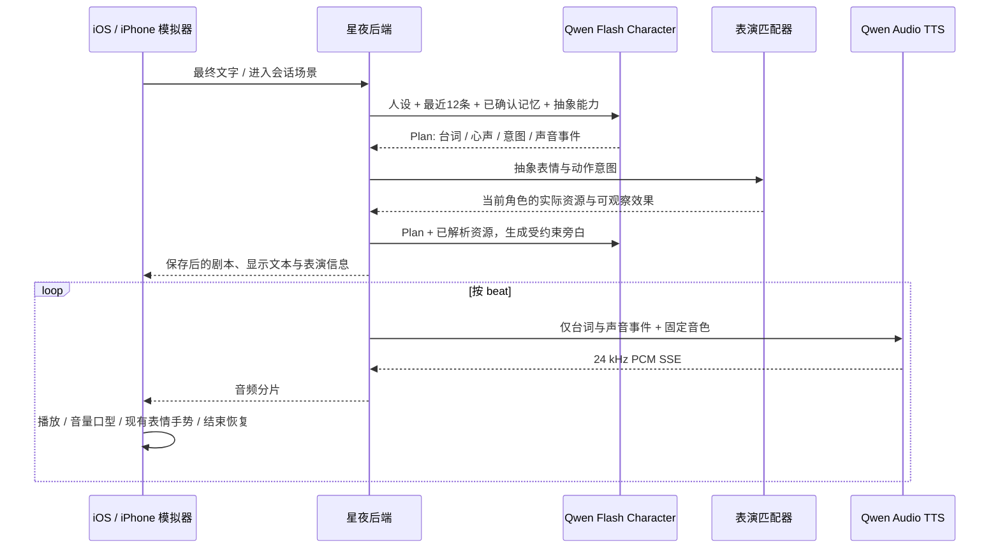

# 星夜真实角色 AI · v0.48 / build 69

2026-09-30。依据用户提供的《AI虚拟角色聊天产品完整实施方案 v4.3》实现第一版真实链路。输入文档与付费 Key 位于用户私有目录，不进入公开仓库。当前仅开放琪宝、豆日向；保留原 3D 渲染、原作表现、自然待机、音乐和聊天界面。

> 当日后续修订：用户要求取消日常聊天的本机额度限制，并修复“上一轮还在结束”。当前源码的限制开关、可打断流和渐进回复设计见[连续对话修复](2026-09-30-ai-turn-handoff.md)。下文 v0.48 的串行时序是历史实现；新客户端通过请求头协商正文/语音先行、旁白后补。部署验证情况以新记录为准。

## 已实现的链路



识别另走 `App 麦克风 → 16 kHz 单声道 PCM WebSocket → Fun-ASR → partial / final → 可编辑草稿`。用户确认发送后才调用角色模型，不把不稳定的 partial 当作新的一轮对话。

固定模型：

| 职责 | 模型 | 行为 |
|---|---|---|
| 对话计划及最终旁白 | `qwen-flash-character-2026-02-26` | JSON 对象输出，两阶段分别校验 |
| 实时识别 | `fun-asr-realtime` | 等待 task-started 后上传，句子去重，最终稿确认 |
| 流式合成 | `qwen-audio-3.1-tts-flash` | HTTP SSE，24 kHz PCM，按 beat 控制情感/语气 |
| 声音设计 | `voice-enrollment` 的 create_voice | 目标为上述 TTS，每角色每版本一次，保存 voice_id 和预览 |

协议以官方参考为准：[角色模型](https://help.aliyun.com/zh/model-studio/qwen-flash-character)、[结构化输出](https://help.aliyun.com/zh/model-studio/qwen-structured-output)、[Qwen Audio HTTP TTS](https://help.aliyun.com/zh/model-studio/qwen-audio-tts-http-api)、[声音设计](https://help.aliyun.com/zh/model-studio/voice-design-api-references)、[Fun-ASR 客户端事件](https://help.aliyun.com/zh/model-studio/fun-asr-client-events)、[Fun-ASR 服务端事件](https://help.aliyun.com/zh/model-studio/fun-asr-server-events)。没有混用 Qwen3-TTS 的另一套接口或复用测试音色。

## 人设、声音与表演

琪宝是安静慢热、观察细节的小书屋伙伴，豆日向是面包房里好奇开朗的小帮手。v0.54.2 按用户要求重做两款稚嫩女孩动漫音色：琪宝偏清澈软糯、安静略慢，豆日向偏清甜明亮、轻快活泼，详见[音色第二版](2026-09-30-character-voices-v2.md)。家庭、成长、兴趣、价值观、说话习惯及渐进披露的小秘密写在 `services/character_ai/profiles.py`。这些是虚构角色设定，不能说成真人身份或捏造与用户发生过的经历。

声音描述不模仿具体声优；每人有独立的生成音色绑定，新版预览分别约 5 秒和 6 秒。启动、构建、普通对话和重播都不重新设计音色。管理端才能创建或确认绑定；前端不能传任意 voice_id 绕过角色绑定。显式新版本设计先生成候选，确认前保留旧音色服务；替换须提供候选 job_id，旧绑定归档。

第一阶段只看到抽象意图，不看到骨骼、Morph 或资产编号。表演匹配器与客户端当前角色的实际清单取交集；目前审阅映射琪宝 15 项、豆日向 14 项，覆盖表情与原作手势。不是把所有换装、睡眠和循环姿势开放给 AI 任意触发。

选择考虑语义、强度、角色风格、上下文、近期使用、稀有度和使用次数，并执行冷却。没有能力就退到 neutral/idle。`wave → open_hands` 只说明手指张开的姿态，不能说已经举手挥舞。表演结束或中断恢复用户原选择；手动调整表现会先结束 AI 临时表演，镜头不因说话而改动。

旁白有两类：performed 只能使用已解析的可观察效果原句，可以组合标点；literary 允许停顿、安静、对话节奏及已审核的角色外貌事实，不能借文学描写虚构动作、阳光、食物或家具。仅有“正确引用”仍不足以证明整段文字：优先保留模型写出的可核实短句，必要时仅显示模型选择的有效引文，其余省略，不为补一句旁白反复付费。v0.54 的事实来源、并行交付与字体设计见[分层回复](2026-09-30-conversation-presentation.md)。后续场景具备事实元数据时再扩展环境旁白。

心声是角色的虚构心理，和台词分开显示；hidden/unlock_required 不下发正文。未实现付费解锁。语音只合成 dialogue 与允许的 vocal_event；心声、旁白、资源编号、JSON 及控制标签不进入朗读。

支持 gasp/sigh/throat_clear/giggle/laugh/cough/snort，并在供应商适配层转换标签；短回复最多一次、一般最多两次，连续同种声音事件会被抑制。情感/语气按 beat 转换为 TTS 控制标签与自然语言 instruction。

## 上下文、记忆、生命周期

- 后端 SQLite WAL 按安装实例 + 当前账号 + 角色隔离；客户端已有的访客转账号资料继续保留。空的后端会接收本机最多 12 条真实历史，用于首次切换账号/迁移延续会话。
- 使用最近 12 条消息、相关度/重要度/时间排序的最多 6 条记忆。AI 提取的是候选，出现在现有记忆确认流程，用户确认后才入后续上下文。删除或修改的手动记忆以下次请求的客户端列表为准，不另留不可删除的暗中事实库。
- 关系亲近/信任/冲突、情绪与精力分别保存，变化允许列表、每轮增量上限、0–1 限制和情绪衰减在程序端执行。
- 首次见面、App 启动、换角色使用真实模型问候；普通保留会话的 Tab 返回不再请求。固定问候文案已删除。
- 日常呼吸、眨眼、风动继续由 Unity 本机执行，零模型调用。用户真实发言完成后，前台空闲 150–240 秒才有一次语义主动判断；输入中/录音中/弹窗/后台会抑制或取消。服务端允许 do_nothing、visual_only、thought_only、proactive_speech，保存主动冷却与未回应次数，概率按 1、0.5、0.2 衰减，达到3次停止。当前客户端有意不做无人回应时无限循环的付费定时器。
- 切角色、切后台、停止生成、录音和改播其他消息取消本轮网络/音频与临时表演。可见台词先落盘，TTS 故障不会丢掉已经生成的文字。
- 清空聊天会先清除该账号该角色的后端上下文、幂等结果与相关服务端音频，再清本机历史；无法连接时明确提示未清空，设定与已确认记忆保留。

## 接口与文件

| 接口 | 作用 |
|---|---|
| `GET /health` | 无付费探活，不返回凭证或角色资料 |
| `GET /v1/status` | 客户端连接与音色就绪状态 |
| `POST /v1/conversations/{character}/messages` | JSON 请求，SSE 剧本与语音 |
| `POST /v1/conversations/{character}/messages/{id}/audio` | 优先重播缓存，缺失时明确点击才重新合成 |
| `DELETE /v1/conversations/{character}/messages` | 删除本用户此角色历史与服务端语音 |
| `WS /v1/asr/{character}` | PCM 输入、partial/final 输出、finish 控制 |
| `POST /v1/characters/{character}/voice-designs` | 管理凭证；默认返回已有绑定，显式 `revision` 创建或返回该已定义版本的候选 |
| `POST /v1/characters/{character}/voice-designs/approve` | 管理凭证；替换现有绑定时用 `job_id` 指定候选，事务内归档并切换 |
| `GET /v1/admin/usage` | 管理凭证，调用与用量汇总 |

SSE 有 `reply.plan.ready`、`segment.visual.resolved`、`reply.narration.ready`、`segment.audio.started/chunk/ready`、`reply.completed`、warning/error。原生消费保持 request token 与账号一致才落盘，消息的 AIScript 保留重播用分段和实际资源信息。普通 UI 不显示协议字段。

核心源码：`services/character_ai/{schemas,profiles,director,prompts,orchestrator,provider,asr,storage,app}.py`；原生 `CharacterAI.swift`、`CloudSpeech.swift`、`CompanionSession.swift`、`AIReplyContent.swift`；ViewerCoordinator 负责现有 Unity 表演接口。

## 费用与数据保护

付费 Key 仅保存在私有服务端配置，不写进 Swift、App 包、Xcode 设置或 Git。App 中的 `Connection.json` 只有开发网关 URL 和独立随机客户端凭证；管理凭证也不会进入 App。公开 Git 忽略 `.local/`，真实音色数据、个人聊天、验证截图和 CSV 不推送。

日常对话的本机每日调用次数、合成字符和识别时长额度已在源码中默认关闭（`enforce_conversation_limits=false`），旧配置里的数值不再自动拦截聊天。只在显式启用该开关的专门测试或部署中执行可选上限。新部署的音色设计默认总计上限为 2 次；用户要求重做两款音色后，本开发机私有配置显式调整为 4 次（原版 2 次＋新版 2 次），历史计费记录保留。同一角色/版本不会重复设计，超时也不自动重试。调用前仍使用 SQLite 写事务原子记账；失败、中断、未发送分别记录，不把估算当作实际百炼账单。自动测试仍默认禁用真实付费调用。

同一 request_id 和相同内容返回已有结果；内容不同拒绝；中断但未确认成功的请求不会自动再次计费。结构校验最多一次纠正；网络错误不自动重试。内部中文 beat 编号与字符串心声等无语义差异的格式由本地规范化，不专门请求模型改格式。

服务端语音缓存128 MiB按访问时间清理；App语音缓存沿用64 MiB磁盘/16 MiB内存上限，可在设置清理。重播有缓存时零上游请求。缓存丢失时用户主动重播可能重新付费合成，聊天正文不丢。

测试费用只能根据百炼账单确定。本机记录请求状态、供应商 request_id、tokens、字符/音频时长，不把程序估算冒充实际扣费。普通 pytest 和普通 UI 测试禁用付费；真实测试必须 `--allow-paid` 或 `STARRY_LIVE_AI_TESTS=1` 显式开启，测试结束关闭App，避免后台主动问候耗费。

## 本机运行与更新

后台服务部署在 `~/Library/Application Support/StarryNight/CharacterAI/`：`code/`、`.venv/`、`data/state.sqlite3`、`data/voices/`、`data/audio/`、私有`settings.json`和`logs/`。LaunchAgent 为 `com.starrynight.character-ai`，监听8766。源仓库配置会指向同一个data目录，维护脚本和服务共享费用计数。旧`.local/character-ai`状态保留为迁移备份。

```bash
# 修改后端后：安装锁定依赖、更新部署副本并重启，不产生模型调用
python3 scripts/install_character_ai_agent.py
curl --noproxy '*' http://127.0.0.1:8766/health
# 临时前台调试前，先停后台服务，避免端口冲突
launchctl bootout gui/$(id -u)/com.starrynight.character-ai
zsh scripts/start_character_ai.sh
```

关闭或睡眠 Mac 会中止本机服务。当前连接使用 Mac 的 `.local` 名称，换网络通常不必改IP，但手机仍须同一可达网络。首次系统请求本地网络/麦克风权限时需允许对应权限。

要脱离 Mac，应把同一后端和私有状态部署到独立服务器、配置HTTPS，再生成新客户端连接并编译。**当前开发凭证和模拟账号不是正式互联网身份系统**；公网开放之前需接入真实账户鉴权/访客升级、账号数据归属、限流、监控与备份，不能直接把本机端口暴露公网。本轮没有云服务器登录资料，没有声称已完成云部署或真实微信/手机号登录。

## 关键问题与处理

1. 角色模型偶尔输出中文 beat 标签或直接字符串心声。最初严格类型触发多余纠正调用；现在仅规范化这两种表示，仍校验正文/情绪/重复编号等真正约束。
2. 模型曾引用合法手势后编造递牛奶。已改为按可观察效果原句核验 performed，不能仅相信模型的 evidence 字段。
3. TTS 接入曾发生流式 JSON 解析失败。按完整 SSE 事件收集多行 data，过滤保活，保留可定位的格式诊断；失败时保留文本且不自动重复扣费。
4. WebSocket 15+ 自动读取系统代理。Mac 配置代理时缺 python-socks 导致连接前 ImportError，已加入锁定依赖；这两次确认未发送任务的预留已标记 not_sent。参考[官方代理说明](https://websockets.readthedocs.io/en/stable/topics/proxies.html)。
5. launchd 直接从Documents内的venv启动停在文件打开，未监听端口。改为标准Application Support隔离部署，私有数据随服务移动、原数据保留，健康检查通过，无需更改系统隐私权限。
6. UI错误提示测试最初使用错误的容器类型定位元素，真实错误文字已显示；改为定位提示文字后免费回归通过。真实付费测试单项已通过，不能把初次整个混合测试套件描述成全绿。
7. 设备Release签名编译成功，尝试Wi-Fi安装时连接中断，遵循用户要求继续模拟器，不反复等待手机。
8. 最后普通启动的混音器采样暴露Swift6线程隔离问题：AVAudioNodeTapBlock没有Sendable标注，直接在MainActor方法内创建会把主线程检查带到音频线程。改为nonisolated工厂创建回调，只将标量音量切回主线程。新增真实AVAudioEngine免费回归，验证分段、只有声音事件的片段、缓存、取消；不靠编译成功代替运行验证。
9. JSON Object只保证合法JSON，不保证业务Schema，官方并未把这个Character快照列入严格JSON Schema模式支持清单。一次启动输出了递归嵌套dialogue；保留拒绝行为，增加短结构范例与明确同级字段约束，纠正阶段从空对象重写并降低随机度，最多一次。没有悄悄丢弃不合法控制字段来冒充成功。
