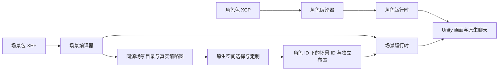

# 场景与角色独立组合

`EnvironmentStage` 只引用几何和清单，无角色骨骼、表情或动作知识。`EnvironmentDirector` 负责当前场景、过渡、光影和环境设置；角色高度只作为单位适配输入。`CharacterStudioDriver` 保留旧桥接入口，将人物外观交给原执行器，将场景配置交给新执行器。

Swift `EnvironmentDescriptor` 读取生成目录，按场景声明产生卡片和配色控件。新增外部场景不添加 Swift/Unity 业务分支。五个原生场景由美术构建器适配；清风小院通过标准 GLB 导入器接入。导入时生成真实缩略图，不把概念图片当实际模型预览。

## 存档和编辑事务

旧 `CharacterStudio.room/light*` 字段保持兼容。新增可选 `environments` 字典，以场景 ID 保存配色、装饰、方向、灯光。旧档缺字段时按推荐值迁入，不删除已有聊天/人格/人物外观。每个角色仍有自己的 studio，两个角色的布景互不改写。

预览只改变内存草稿和实时画面；完成才保存；取消恢复完整原值。选择别的场景前暂存当前场景的布置，再读目标场景设置。“重置当前空间”只重置当前场景，不改人物和其他场景；人物页的“恢复推荐”也保留全部空间设置。

加载未知已保存场景时显示默认客厅，不删除字典中的旧场景记录；重新装回同 ID 场景可恢复其布置。当前没有下载、安装及删除场景的终端用户入口。

## 过渡

灯光方向/强度、配色和场景方向按实际 delta time 指数平滑。场景几何或装饰开关变化时，用临界阻尼遮罩淡入，在遮罩接近完全覆盖时替换，再淡出。过程覆盖 3D 画面，原生聊天/弹层保持原交互；不截取双份高分辨率渲染、不改变相机 FOV/距离、不修改角色比例。

快速连选合并到最后目标；取消编辑同样经过场景过渡。新增 environmentConfigured 回执在过渡稳定后发出，包含 selectedId/visibleId/palette/angle/transitioning 与实际光源角度。常规使用不逐帧把状态传回 Swift。

## 兼容与后续能力

XEP 与 XCP 分别采用主版本、内容版本、必需/可选能力。构建同时核对角色目录和场景目录 SHA-256，防止新界面链接旧资源。校验器拒绝损坏资源、路径穿越、代码资源、未知必需能力和不兼容覆盖；稳定配色 ID 不能静默删除。

当前能力是 geometry、lighting、palette、decor 的 @1。家具布局可扩展 environment.layout@1（物件 ID、锚点、碰撞和撤销）；天气可扩展 environment.weather@1；音景可扩展 environment.audio@1；时段、可交互物件、角色坐下的接触锚点应独立声明。它们目前没有执行器，不能列为必需能力或声称已实现。

用户原有背景音乐继续可用，本轮不强制更换音乐、不让场景包下载或启动音频。未来音景可接既有音频焦点管理，避免与人物语音抢音量。

依据：[Unity RenderSettings](https://docs.unity.com/en-us/engine/6000.0/script-reference/unityengine/rendersettings) 管理场景环境光等状态；[Unity glTFast 编辑器导入](https://github.com/Unity-Technologies/com.unity.cloud.gltfast/blob/main/Packages/com.unity.cloud.gltfast/Documentation~/ImportEditor.md) 用于将 GLB 编译到引擎资源。原始 GLB/JSON 长期保留，平台编译产物可重新生成。

## 与姿势平台组合

Character API 1.1 已提供地面支撑的持续站/坐/蹲/侧躺和对话参数配置。场景独立选择不重置角色姿势。XEP 1.0 仍不提供椅子/床/坡面的自动接触锚点或 IK；家具贴合不能通过修改背景高度来伪装完成。未来 surface/contact 能力需单独协商和失败回退，见 [姿势与接触扩展边界](../character-standard/05-posture-standard.md)。
